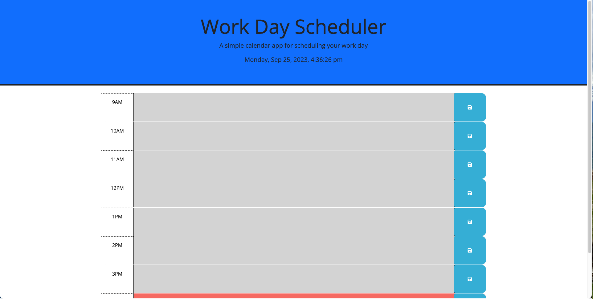
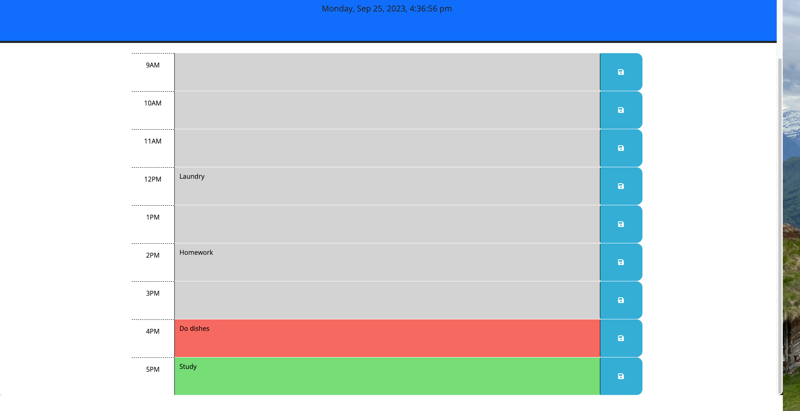

# work-day-scheduler
## Description
- My motivation for this project was to be able to use dayjs and local storage to save data in timeblocks that correspond with real time
- I built this project to continue to expand my knowledge on JavaScript, JQuery and how to incorporate third party APIs
- This application solves the problem of having a functional work day scheduler to keep myself organized throughout the day.
- I learned a lot more about JavaScript and how to use third party APIs by reading their documentation.

## Installation
To install this application, simply click on this link to open it in the browser.
https://dylanhoryza.github.io/work-day-scheduler/
## Usage
To use this application, type any tasks or things you need to get done in the corresponding timeblock. Click the save icon to save your data. Green timeblocks show future events, red shows current, and grey shows past.
   
   
   

   
## Credits
My tutor, Mila Hose helped me with setting and getting local storage.
## License
N/A

